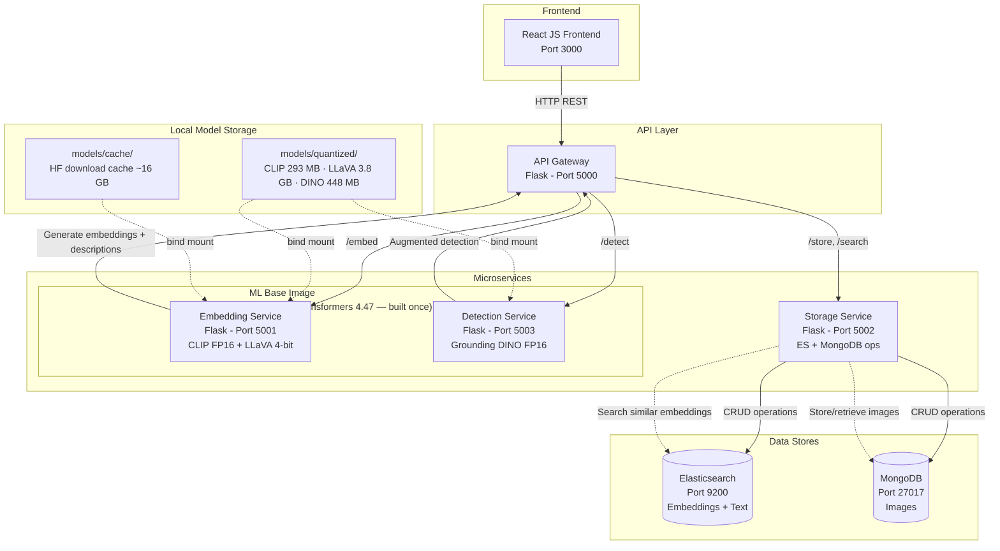
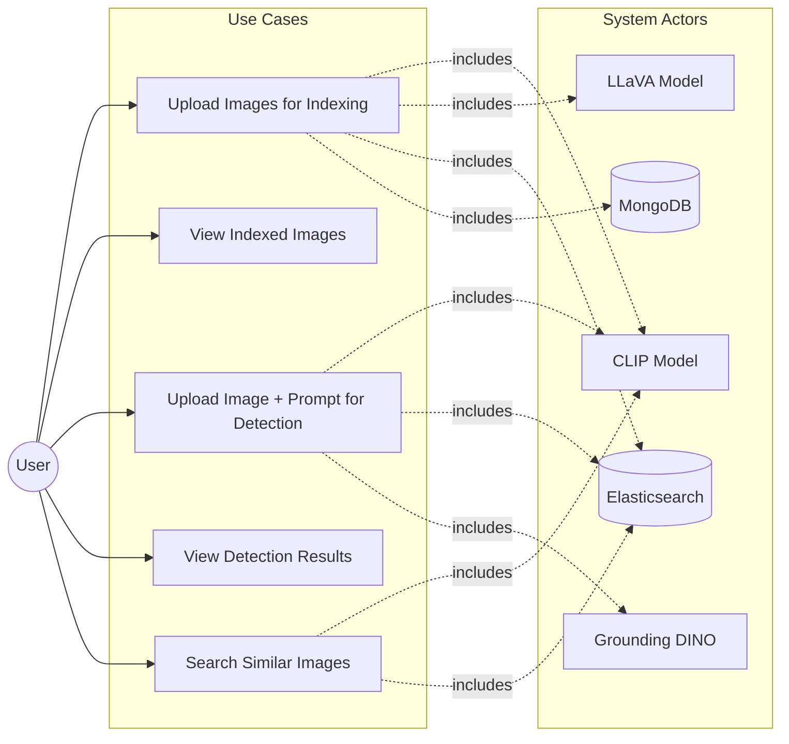
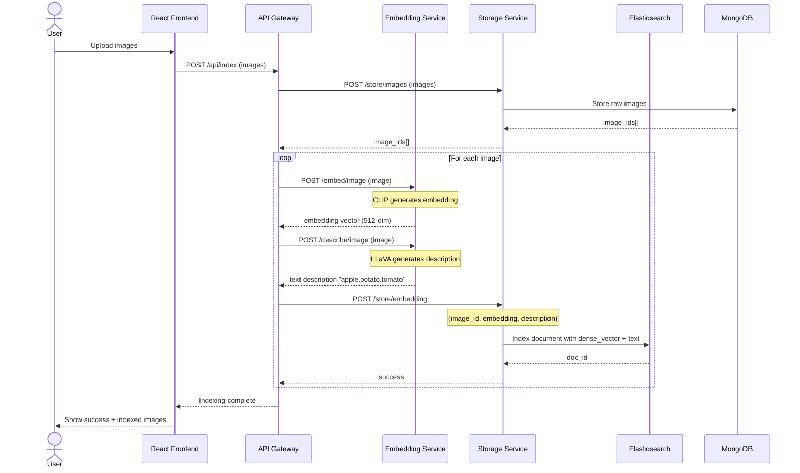
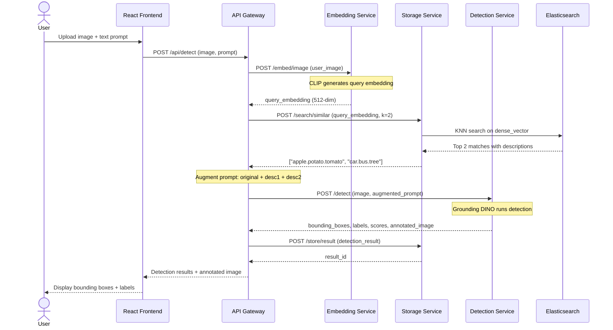
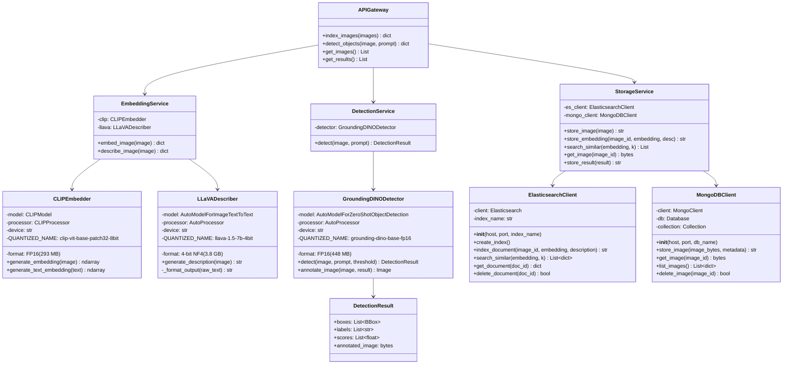

# System Architecture

# Use Case Diagram

# Sequence Diagram — Image Indexing Pipeline

# Sequence Diagram — Object Detection Pipeline

# Class Diagram

# Model Memory & Storage Requirements

## GPU VRAM Usage

| Model | HuggingFace ID | Format | VRAM at Inference |
|---|---|---|---|
| CLIP ViT-B/32 | `openai/clip-vit-base-patch32` | FP16 | ~300 MB |
| LLaVA 1.5 7B | `llava-hf/llava-1.5-7b-hf` | 4-bit NF4 | ~3.8 GB |
| Grounding DINO | `IDEA-Research/grounding-dino-base` | FP16 | ~900 MB |
| **Total (all 3)** | | | **~5-6.5 GB** |

> Tested on NVIDIA RTX 4070 Laptop GPU (8 GB VRAM). All 3 models load simultaneously with headroom for inference buffers.

## Disk Storage

| Directory | Contents | Size |
|---|---|---|
| `models/cache/` | HuggingFace download cache (original FP32/FP16 weights) | ~16 GB |
| `models/quantized/clip-vit-base-patch32-8bit/` | CLIP FP16 weights + processor | 293 MB |
| `models/quantized/llava-1.5-7b-4bit/` | LLaVA 4-bit NF4 weights + processor | 3.8 GB |
| `models/quantized/grounding-dino-base-fp16/` | Grounding DINO FP16 weights + processor | 448 MB |
| **Total disk** | cache + quantized | **~20.5 GB** |

## System RAM

| Scenario | RAM Needed |
|---|---|
| Building Docker images | ~4 GB |
| Running quantization script | ~16 GB (LLaVA quantization peak) |
| Running all services | ~8-12 GB |
| **Recommended minimum** | **16 GB (32 GB preferred)** |
